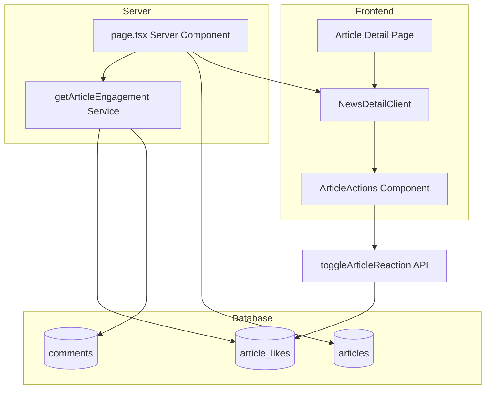

# Design Document: Article Engagement Real Data

## Overview

Fitur ini mengimplementasikan sistem engagement artikel yang real dengan menyimpan likes/dislikes ke database Supabase dan menampilkan data real (likes count, dislikes count, comments count, trending rank) di halaman detail artikel. Sistem ini menggantikan nilai hardcoded di komponen ArticleActions dengan data yang diambil dari database.

## Architecture



## Components and Interfaces

### 1. Database Migration (00032_article_likes.sql)

```sql
-- Create reaction_type enum
CREATE TYPE reaction_type AS ENUM ('like', 'dislike');

-- Create article_likes table
CREATE TABLE article_likes (
  article_id UUID REFERENCES articles(id) ON DELETE CASCADE,
  user_id UUID REFERENCES profiles(id) ON DELETE CASCADE,
  reaction_type reaction_type NOT NULL,
  created_at TIMESTAMPTZ DEFAULT NOW() NOT NULL,
  PRIMARY KEY (article_id, user_id)
);

-- Create indexes
CREATE INDEX idx_article_likes_article ON article_likes(article_id);
CREATE INDEX idx_article_likes_user ON article_likes(user_id);

-- RLS Policies
ALTER TABLE article_likes ENABLE ROW LEVEL SECURITY;

CREATE POLICY "Anyone can view article likes"
  ON article_likes FOR SELECT USING (true);

CREATE POLICY "Authenticated users can insert own reactions"
  ON article_likes FOR INSERT
  WITH CHECK (auth.uid() = user_id);

CREATE POLICY "Users can update own reactions"
  ON article_likes FOR UPDATE
  USING (auth.uid() = user_id);

CREATE POLICY "Users can delete own reactions"
  ON article_likes FOR DELETE
  USING (auth.uid() = user_id OR
         EXISTS (SELECT 1 FROM profiles WHERE id = auth.uid() AND role = 'admin'));
```

### 2. Engagement Service Interface

```typescript
// src/lib/supabase/services/engagement.ts

interface ArticleEngagement {
  likesCount: number;
  dislikesCount: number;
  commentsCount: number;
  trendingRank: number | null;
  userReaction: "like" | "dislike" | null;
}

// Server-side function to get all engagement data
async function getArticleEngagement(
  articleId: string,
  userId?: string
): Promise<ArticleEngagement>;

// Client-side function to toggle reaction
async function toggleArticleReaction(
  articleId: string,
  userId: string,
  reactionType: "like" | "dislike"
): Promise<{ success: boolean; newReaction: "like" | "dislike" | null }>;
```

### 3. Updated ArticleActions Props

```typescript
interface ArticleActionsProps {
  articleId: string;
  initialLikes: number; // Real count from database
  initialDislikes: number; // Real count from database
  commentCount: number; // Real count from database
  trendingRank: number | null;
  userReaction: "like" | "dislike" | null;
}
```

### 4. API Route for Reactions

```typescript
// src/app/api/articles/[id]/reaction/route.ts

// POST: Toggle reaction
// Body: { reactionType: 'like' | 'dislike' }
// Response: { success: boolean, newReaction: 'like' | 'dislike' | null, likesCount: number, dislikesCount: number }
```

## Data Models

### article_likes Table

| Column        | Type                    | Constraints                             |
| ------------- | ----------------------- | --------------------------------------- |
| article_id    | UUID                    | PK, FK → articles(id) ON DELETE CASCADE |
| user_id       | UUID                    | PK, FK → profiles(id) ON DELETE CASCADE |
| reaction_type | ENUM('like', 'dislike') | NOT NULL                                |
| created_at    | TIMESTAMPTZ             | DEFAULT NOW()                           |

### Engagement Data Flow

1. **Server-side (page.tsx)**: Fetch article + engagement data
2. **Pass to Client**: NewsDetailClient receives engagement props
3. **Display**: ArticleActions shows real counts
4. **Interaction**: User clicks like/dislike → API call → optimistic update

## Correctness Properties

_A property is a characteristic or behavior that should hold true across all valid executions of a system-essentially, a formal statement about what the system should do. Properties serve as the bridge between human-readable specifications and machine-verifiable correctness guarantees._

### Property 1: Reaction Counts Match Database

_For any_ article, the displayed likes count and dislikes count SHALL equal the actual count of rows in article_likes table with the corresponding reaction_type.

**Validates: Requirements 2.1, 2.2**

### Property 2: Unique User Reaction Per Article

_For any_ user and article combination, there SHALL be at most one row in article_likes table (enforced by composite primary key).

**Validates: Requirements 1.2**

### Property 3: Reaction Toggle Behavior

_For any_ user with an existing reaction on an article:

- Clicking the same reaction type SHALL remove the reaction (row deleted)
- Clicking the opposite reaction type SHALL update the reaction_type

**Validates: Requirements 3.3, 3.4**

### Property 4: Comments Count Accuracy

_For any_ article, the displayed comments count SHALL equal the count of rows in comments table WHERE article_id matches AND is_approved = true.

**Validates: Requirements 4.1, 4.3**

### Property 5: Trending Rank Calculation

_For any_ published article, its trending rank SHALL equal its position when all published articles are ordered by views_count descending.

**Validates: Requirements 5.1, 5.2**

### Property 6: RLS User Isolation

_For any_ authenticated user, they SHALL only be able to INSERT, UPDATE, or DELETE rows in article_likes where user_id matches their auth.uid().

**Validates: Requirements 6.2, 6.3, 6.4**

## Error Handling

| Scenario                          | Handling                                                    |
| --------------------------------- | ----------------------------------------------------------- |
| User not logged in tries to react | Redirect to login with return URL                           |
| Database error on reaction toggle | Show error toast, revert optimistic update                  |
| Article not found                 | Return 404 page                                             |
| RLS policy violation              | Return 403, log error                                       |
| Network error                     | Retry with exponential backoff, show error after 3 attempts |

## Testing Strategy

### Unit Tests

- Test engagement service functions with mocked Supabase client
- Test ArticleActions component renders correct counts
- Test reaction toggle logic (optimistic updates)

### Property-Based Tests

- **Property 1**: Generate random articles with random reactions, verify counts match
- **Property 2**: Attempt to insert duplicate reactions, verify constraint violation
- **Property 3**: Generate random reaction sequences, verify final state is correct
- **Property 4**: Generate articles with mix of approved/unapproved comments, verify count
- **Property 5**: Generate articles with random views, verify rank ordering

### Integration Tests

- Test full flow: load article → display engagement → toggle reaction → verify update
- Test RLS policies with different user roles

### Testing Framework

- Use Vitest for unit and property tests
- Use fast-check for property-based testing
- Minimum 100 iterations per property test
