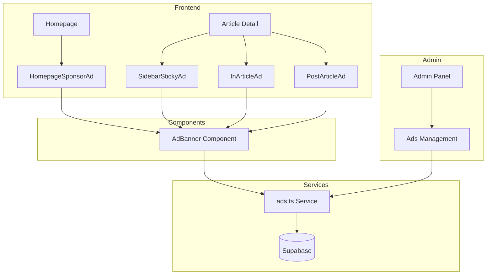

# Design Document: Premium Ad Slots

## Overview

Sistem iklan premium dengan 4 slot strategis yang memberikan nilai tinggi bagi advertiser tanpa mengganggu UX pembaca. Implementasi menggunakan Supabase untuk data storage, React components untuk display, dan tracking sederhana untuk metrics.

## Architecture



## Components and Interfaces

### 1. Database Schema

```sql
-- ads table
CREATE TABLE ads (
  id UUID PRIMARY KEY DEFAULT gen_random_uuid(),
  title VARCHAR(255) NOT NULL,
  image_url TEXT NOT NULL,
  target_url TEXT NOT NULL,
  slot_type VARCHAR(50) NOT NULL CHECK (slot_type IN ('sidebar_sticky', 'in_article', 'homepage_hero', 'post_article')),
  is_active BOOLEAN DEFAULT true,
  start_date TIMESTAMP WITH TIME ZONE NOT NULL,
  end_date TIMESTAMP WITH TIME ZONE NOT NULL,
  impressions INTEGER DEFAULT 0,
  clicks INTEGER DEFAULT 0,
  created_at TIMESTAMP WITH TIME ZONE DEFAULT NOW(),
  updated_at TIMESTAMP WITH TIME ZONE DEFAULT NOW()
);

-- Index for efficient querying
CREATE INDEX idx_ads_slot_active ON ads(slot_type, is_active, start_date, end_date);
```

### 2. TypeScript Interfaces

```typescript
// src/types/ads.ts
export type AdSlotType =
  | "sidebar_sticky"
  | "in_article"
  | "homepage_hero"
  | "post_article";

export interface Ad {
  id: string;
  title: string;
  image_url: string;
  target_url: string;
  slot_type: AdSlotType;
  is_active: boolean;
  start_date: string;
  end_date: string;
  impressions: number;
  clicks: number;
  created_at: string;
  updated_at: string;
}

export interface AdCreateInput {
  title: string;
  image_url: string;
  target_url: string;
  slot_type: AdSlotType;
  start_date: string;
  end_date: string;
  is_active?: boolean;
}
```

### 3. Ad Service Functions

```typescript
// src/lib/supabase/services/ads.ts

// Get active ad for a specific slot
async function getActiveAdForSlot(slotType: AdSlotType): Promise<Ad | null>;

// Get all ads (admin)
async function getAllAds(): Promise<Ad[]>;

// Create new ad
async function createAd(input: AdCreateInput): Promise<Ad>;

// Update ad
async function updateAd(id: string, input: Partial<AdCreateInput>): Promise<Ad>;

// Delete ad
async function deleteAd(id: string): Promise<void>;

// Track impression
async function trackImpression(adId: string): Promise<void>;

// Track click
async function trackClick(adId: string): Promise<void>;

// Calculate CTR
function calculateCTR(impressions: number, clicks: number): number;
```

### 4. React Components

```typescript
// src/components/ads/AdBanner.tsx
interface AdBannerProps {
  slotType: AdSlotType;
  className?: string;
}

// src/components/ads/SidebarStickyAd.tsx
// Wrapper for sidebar with sticky positioning

// src/components/ads/InArticleAd.tsx
// Component to insert ad after 3rd paragraph

// src/components/ads/HomepageSponsorAd.tsx
// Hero section sponsor with "Sponsored" label

// src/components/ads/PostArticleAd.tsx
// Ad placement after article content
```

## Data Models

### Ad Slot Specifications

| Slot Type      | Location                       | Size (Desktop)     | Size (Mobile)  |
| -------------- | ------------------------------ | ------------------ | -------------- |
| sidebar_sticky | Right sidebar, article pages   | 300x250 or 300x600 | 300x250 inline |
| in_article     | After 3rd paragraph            | 300x250            | 300x250        |
| homepage_hero  | Hero section                   | 728x90 or 970x250  | 320x100        |
| post_article   | After article, before comments | 728x90             | 320x100        |

## Correctness Properties

_A property is a characteristic or behavior that should hold true across all valid executions of a system—essentially, a formal statement about what the system should do. Properties serve as the bridge between human-readable specifications and machine-verifiable correctness guarantees._

### Property 1: Valid Slot Type Validation

_For any_ ad creation input, the system should only accept slot_type values that are one of the 4 valid types: 'sidebar_sticky', 'in_article', 'homepage_hero', 'post_article'. Any other slot_type should be rejected.

**Validates: Requirements 1.1, 2.2**

### Property 2: Active Ad Filtering

_For any_ set of ads in the database, the getActiveAdForSlot function should only return ads where:

- is_active is true
- current date is between start_date and end_date (inclusive)
- slot_type matches the requested slot

**Validates: Requirements 1.2, 2.4**

### Property 3: In-Article Ad Placement

_For any_ article content with N paragraphs (where N >= 3), the InArticleAd component should insert the ad after exactly the 3rd paragraph. For articles with fewer than 3 paragraphs, the ad should be placed at the end.

**Validates: Requirements 1.5**

### Property 4: Impression Tracking Increment

_For any_ ad, calling trackImpression should increment the impressions count by exactly 1.

**Validates: Requirements 3.1**

### Property 5: Click Tracking Increment

_For any_ ad, calling trackClick should increment the clicks count by exactly 1.

**Validates: Requirements 3.2**

### Property 6: CTR Calculation

_For any_ ad with impressions > 0, CTR should equal (clicks / impressions) \* 100. For ads with 0 impressions, CTR should be 0.

**Validates: Requirements 3.4**

## Error Handling

| Error Scenario            | Handling Strategy                      |
| ------------------------- | -------------------------------------- |
| No active ad for slot     | Return null, component renders nothing |
| Invalid slot type         | Throw validation error                 |
| Database connection error | Log error, return null for display     |
| Invalid image URL         | Show placeholder image                 |
| Tracking failure          | Log error, don't block user action     |

## Testing Strategy

### Unit Tests

- Validation functions for ad input
- CTR calculation function
- Date range checking logic

### Property-Based Tests

- Use fast-check library for TypeScript
- Minimum 100 iterations per property test
- Test ad filtering with random date ranges
- Test slot type validation with random strings
- Test CTR calculation with random numbers

### Integration Tests

- Ad CRUD operations with Supabase
- Tracking increment operations
- Component rendering with various ad states
