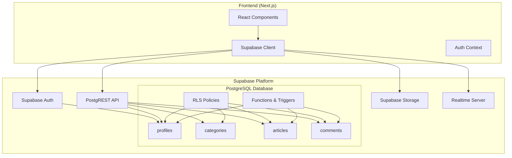

# Design Document: Supabase Backend Architecture

## Overview

This design document outlines the technical architecture for implementing a Supabase-based backend for the News Portal application. The architecture leverages Supabase's integrated services including PostgreSQL database, Authentication, Storage, and Row Level Security to create a serverless backend that can be accessed directly from the Next.js frontend without requiring a separate backend server.

The design follows a "Backend as a Service" (BaaS) pattern where all data operations, authentication, and file storage are handled through Supabase's client SDK, with security enforced at the database level through RLS policies.

## Architecture



### Data Flow

1. **Authentication Flow**: User credentials → Supabase Auth → JWT Token → Client stores session
2. **Data Read Flow**: Client request → PostgREST → RLS check → PostgreSQL → Response
3. **Data Write Flow**: Client mutation → PostgREST → RLS check → Triggers → PostgreSQL → Response
4. **File Upload Flow**: Client → Storage API → Bucket policy check → S3-compatible storage
5. **Realtime Flow**: Client subscribes → Realtime server → PostgreSQL changes → Broadcast to subscribers

## Components and Interfaces

### 1. Supabase Client Configuration

```typescript
// src/lib/supabase/client.ts
import { createBrowserClient } from "@supabase/ssr";
import { Database } from "@/types/supabase";

export function createClient() {
  return createBrowserClient<Database>(
    process.env.NEXT_PUBLIC_SUPABASE_URL!,
    process.env.NEXT_PUBLIC_SUPABASE_ANON_KEY!
  );
}
```

```typescript
// src/lib/supabase/server.ts
import { createServerClient } from "@supabase/ssr";
import { cookies } from "next/headers";
import { Database } from "@/types/supabase";

export async function createClient() {
  const cookieStore = await cookies();

  return createServerClient<Database>(
    process.env.NEXT_PUBLIC_SUPABASE_URL!,
    process.env.NEXT_PUBLIC_SUPABASE_ANON_KEY!,
    {
      cookies: {
        getAll() {
          return cookieStore.getAll();
        },
        setAll(cookiesToSet) {
          cookiesToSet.forEach(({ name, value, options }) =>
            cookieStore.set(name, value, options)
          );
        },
      },
    }
  );
}
```

### 2. Auth Provider Component

```typescript
// src/components/providers/AuthProvider.tsx
interface AuthContextType {
  user: User | null;
  profile: Profile | null;
  isLoading: boolean;
  signIn: (email: string, password: string) => Promise<void>;
  signUp: (email: string, password: string, fullName: string) => Promise<void>;
  signInWithOAuth: (provider: "google" | "github") => Promise<void>;
  signOut: () => Promise<void>;
}
```

### 3. Data Service Interfaces

```typescript
// src/lib/supabase/services/articles.ts
interface ArticleService {
  getPublishedArticles(options?: {
    category?: string;
    limit?: number;
    offset?: number;
  }): Promise<Article[]>;

  getArticleBySlug(slug: string): Promise<Article | null>;

  getFeaturedArticles(): Promise<Article[]>;

  getBreakingNews(): Promise<Article[]>;

  getTrendingArticles(limit?: number): Promise<Article[]>;

  incrementViewCount(articleId: string): Promise<void>;

  // Admin/Editor operations
  createArticle(data: ArticleInsert): Promise<Article>;
  updateArticle(id: string, data: ArticleUpdate): Promise<Article>;
  deleteArticle(id: string): Promise<void>;
}
```

```typescript
// src/lib/supabase/services/comments.ts
interface CommentService {
  getArticleComments(articleId: string): Promise<Comment[]>;

  createComment(data: CommentInsert): Promise<Comment>;

  updateComment(id: string, content: string): Promise<Comment>;

  deleteComment(id: string): Promise<void>;

  likeComment(commentId: string): Promise<void>;

  unlikeComment(commentId: string): Promise<void>;

  subscribeToComments(
    articleId: string,
    callback: (comment: Comment) => void
  ): RealtimeChannel;
}
```

```typescript
// src/lib/supabase/services/storage.ts
interface StorageService {
  uploadArticleImage(file: File, articleId: string): Promise<string>;

  uploadAvatar(file: File, userId: string): Promise<string>;

  deleteImage(bucket: string, path: string): Promise<void>;

  getPublicUrl(bucket: string, path: string): string;
}
```

## Data Models

### Database Schema

```sql
-- Enable UUID extension
CREATE EXTENSION IF NOT EXISTS "uuid-ossp";

-- Custom types
CREATE TYPE user_role AS ENUM ('member', 'author', 'editor', 'admin');
CREATE TYPE article_status AS ENUM ('draft', 'published', 'archived');

-- Profiles table (extends auth.users)
CREATE TABLE profiles (
  id UUID PRIMARY KEY REFERENCES auth.users(id) ON DELETE CASCADE,
  email TEXT NOT NULL,
  full_name TEXT,
  avatar_url TEXT,
  role user_role DEFAULT 'member' NOT NULL,
  bio TEXT,
  social_links JSONB DEFAULT '{}'::jsonb,
  created_at TIMESTAMPTZ DEFAULT NOW() NOT NULL,
  updated_at TIMESTAMPTZ DEFAULT NOW() NOT NULL
);

-- Categories table
CREATE TABLE categories (
  id UUID PRIMARY KEY DEFAULT uuid_generate_v4(),
  name TEXT UNIQUE NOT NULL,
  slug TEXT UNIQUE NOT NULL,
  color TEXT DEFAULT '#6B7280',
  description TEXT,
  created_at TIMESTAMPTZ DEFAULT NOW() NOT NULL,
  updated_at TIMESTAMPTZ DEFAULT NOW() NOT NULL
);

-- Articles table
CREATE TABLE articles (
  id UUID PRIMARY KEY DEFAULT uuid_generate_v4(),
  title TEXT NOT NULL,
  slug TEXT UNIQUE NOT NULL,
  excerpt TEXT,
  content TEXT,
  image_url TEXT,
  category_id UUID REFERENCES categories(id) ON DELETE SET NULL,
  author_id UUID REFERENCES profiles(id) ON DELETE SET NULL,
  status article_status DEFAULT 'draft' NOT NULL,
  is_breaking BOOLEAN DEFAULT FALSE,
  is_featured BOOLEAN DEFAULT FALSE,
  views_count INTEGER DEFAULT 0,
  read_time TEXT,
  published_at TIMESTAMPTZ,
  created_at TIMESTAMPTZ DEFAULT NOW() NOT NULL,
  updated_at TIMESTAMPTZ DEFAULT NOW() NOT NULL
);

-- Comments table
CREATE TABLE comments (
  id UUID PRIMARY KEY DEFAULT uuid_generate_v4(),
  article_id UUID REFERENCES articles(id) ON DELETE CASCADE NOT NULL,
  user_id UUID REFERENCES profiles(id) ON DELETE CASCADE NOT NULL,
  parent_id UUID REFERENCES comments(id) ON DELETE CASCADE,
  content TEXT NOT NULL,
  likes_count INTEGER DEFAULT 0,
  is_approved BOOLEAN DEFAULT FALSE,
  created_at TIMESTAMPTZ DEFAULT NOW() NOT NULL,
  updated_at TIMESTAMPTZ DEFAULT NOW() NOT NULL
);

-- Comment likes junction table (for tracking who liked what)
CREATE TABLE comment_likes (
  comment_id UUID REFERENCES comments(id) ON DELETE CASCADE,
  user_id UUID REFERENCES profiles(id) ON DELETE CASCADE,
  created_at TIMESTAMPTZ DEFAULT NOW() NOT NULL,
  PRIMARY KEY (comment_id, user_id)
);

-- Indexes for performance
CREATE INDEX idx_articles_category ON articles(category_id);
CREATE INDEX idx_articles_author ON articles(author_id);
CREATE INDEX idx_articles_status ON articles(status);
CREATE INDEX idx_articles_published_at ON articles(published_at DESC);
CREATE INDEX idx_articles_slug ON articles(slug);
CREATE INDEX idx_comments_article ON comments(article_id);
CREATE INDEX idx_comments_user ON comments(user_id);
CREATE INDEX idx_comments_parent ON comments(parent_id);
```

### TypeScript Type Definitions

```typescript
// src/types/supabase.ts
export type Database = {
  public: {
    Tables: {
      profiles: {
        Row: {
          id: string;
          email: string;
          full_name: string | null;
          avatar_url: string | null;
          role: "member" | "author" | "editor" | "admin";
          bio: string | null;
          social_links: Record<string, string>;
          created_at: string;
          updated_at: string;
        };
        Insert: {
          id: string;
          email: string;
          full_name?: string | null;
          avatar_url?: string | null;
          role?: "member" | "author" | "editor" | "admin";
          bio?: string | null;
          social_links?: Record<string, string>;
        };
        Update: {
          full_name?: string | null;
          avatar_url?: string | null;
          role?: "member" | "author" | "editor" | "admin";
          bio?: string | null;
          social_links?: Record<string, string>;
        };
      };
      categories: {
        Row: {
          id: string;
          name: string;
          slug: string;
          color: string;
          description: string | null;
          created_at: string;
          updated_at: string;
        };
        Insert: {
          name: string;
          slug: string;
          color?: string;
          description?: string | null;
        };
        Update: {
          name?: string;
          slug?: string;
          color?: string;
          description?: string | null;
        };
      };
      articles: {
        Row: {
          id: string;
          title: string;
          slug: string;
          excerpt: string | null;
          content: string | null;
          image_url: string | null;
          category_id: string | null;
          author_id: string | null;
          status: "draft" | "published" | "archived";
          is_breaking: boolean;
          is_featured: boolean;
          views_count: number;
          read_time: string | null;
          published_at: string | null;
          created_at: string;
          updated_at: string;
        };
        Insert: {
          title: string;
          slug: string;
          excerpt?: string | null;
          content?: string | null;
          image_url?: string | null;
          category_id?: string | null;
          author_id?: string | null;
          status?: "draft" | "published" | "archived";
          is_breaking?: boolean;
          is_featured?: boolean;
          read_time?: string | null;
          published_at?: string | null;
        };
        Update: {
          title?: string;
          slug?: string;
          excerpt?: string | null;
          content?: string | null;
          image_url?: string | null;
          category_id?: string | null;
          status?: "draft" | "published" | "archived";
          is_breaking?: boolean;
          is_featured?: boolean;
          read_time?: string | null;
          published_at?: string | null;
        };
      };
      comments: {
        Row: {
          id: string;
          article_id: string;
          user_id: string;
          parent_id: string | null;
          content: string;
          likes_count: number;
          is_approved: boolean;
          created_at: string;
          updated_at: string;
        };
        Insert: {
          article_id: string;
          user_id: string;
          parent_id?: string | null;
          content: string;
        };
        Update: {
          content?: string;
          is_approved?: boolean;
        };
      };
    };
  };
};
```

### Database Functions and Triggers

```sql
-- Function to handle new user signup
CREATE OR REPLACE FUNCTION handle_new_user()
RETURNS TRIGGER AS $$
BEGIN
  INSERT INTO public.profiles (id, email, full_name, avatar_url)
  VALUES (
    NEW.id,
    NEW.email,
    NEW.raw_user_meta_data->>'full_name',
    NEW.raw_user_meta_data->>'avatar_url'
  );
  RETURN NEW;
END;
$$ LANGUAGE plpgsql SECURITY DEFINER;

-- Trigger for new user signup
CREATE TRIGGER on_auth_user_created
  AFTER INSERT ON auth.users
  FOR EACH ROW EXECUTE FUNCTION handle_new_user();

-- Function to update updated_at timestamp
CREATE OR REPLACE FUNCTION update_updated_at()
RETURNS TRIGGER AS $$
BEGIN
  NEW.updated_at = NOW();
  RETURN NEW;
END;
$$ LANGUAGE plpgsql;

-- Apply updated_at trigger to all tables
CREATE TRIGGER update_profiles_updated_at
  BEFORE UPDATE ON profiles
  FOR EACH ROW EXECUTE FUNCTION update_updated_at();

CREATE TRIGGER update_categories_updated_at
  BEFORE UPDATE ON categories
  FOR EACH ROW EXECUTE FUNCTION update_updated_at();

CREATE TRIGGER update_articles_updated_at
  BEFORE UPDATE ON articles
  FOR EACH ROW EXECUTE FUNCTION update_updated_at();

CREATE TRIGGER update_comments_updated_at
  BEFORE UPDATE ON comments
  FOR EACH ROW EXECUTE FUNCTION update_updated_at();

-- Function to increment article view count
CREATE OR REPLACE FUNCTION increment_view_count(article_id UUID)
RETURNS VOID AS $$
BEGIN
  UPDATE articles
  SET views_count = views_count + 1
  WHERE id = article_id;
END;
$$ LANGUAGE plpgsql SECURITY DEFINER;

-- Function to generate slug from title
CREATE OR REPLACE FUNCTION generate_slug(title TEXT)
RETURNS TEXT AS $$
BEGIN
  RETURN LOWER(
    REGEXP_REPLACE(
      REGEXP_REPLACE(
        TRIM(title),
        '[^a-zA-Z0-9\s-]', '', 'g'
      ),
      '\s+', '-', 'g'
    )
  );
END;
$$ LANGUAGE plpgsql;

-- Function to toggle comment like
CREATE OR REPLACE FUNCTION toggle_comment_like(p_comment_id UUID, p_user_id UUID)
RETURNS BOOLEAN AS $$
DECLARE
  liked BOOLEAN;
BEGIN
  -- Check if already liked
  IF EXISTS (SELECT 1 FROM comment_likes WHERE comment_id = p_comment_id AND user_id = p_user_id) THEN
    -- Unlike
    DELETE FROM comment_likes WHERE comment_id = p_comment_id AND user_id = p_user_id;
    UPDATE comments SET likes_count = likes_count - 1 WHERE id = p_comment_id;
    liked := FALSE;
  ELSE
    -- Like
    INSERT INTO comment_likes (comment_id, user_id) VALUES (p_comment_id, p_user_id);
    UPDATE comments SET likes_count = likes_count + 1 WHERE id = p_comment_id;
    liked := TRUE;
  END IF;
  RETURN liked;
END;
$$ LANGUAGE plpgsql SECURITY DEFINER;

-- Helper function to get user role
CREATE OR REPLACE FUNCTION get_user_role(user_id UUID)
RETURNS user_role AS $$
DECLARE
  user_role_value user_role;
BEGIN
  SELECT role INTO user_role_value FROM profiles WHERE id = user_id;
  RETURN COALESCE(user_role_value, 'member');
END;
$$ LANGUAGE plpgsql SECURITY DEFINER;
```

### Row Level Security Policies

```sql
-- Enable RLS on all tables
ALTER TABLE profiles ENABLE ROW LEVEL SECURITY;
ALTER TABLE categories ENABLE ROW LEVEL SECURITY;
ALTER TABLE articles ENABLE ROW LEVEL SECURITY;
ALTER TABLE comments ENABLE ROW LEVEL SECURITY;
ALTER TABLE comment_likes ENABLE ROW LEVEL SECURITY;

-- PROFILES POLICIES
-- Everyone can view profiles
CREATE POLICY "Profiles are viewable by everyone"
  ON profiles FOR SELECT
  USING (true);

-- Users can update their own profile (except role)
CREATE POLICY "Users can update own profile"
  ON profiles FOR UPDATE
  USING (auth.uid() = id)
  WITH CHECK (auth.uid() = id);

-- Only admins can update roles
CREATE POLICY "Admins can update any profile"
  ON profiles FOR UPDATE
  USING (get_user_role(auth.uid()) = 'admin');

-- CATEGORIES POLICIES
-- Everyone can view categories
CREATE POLICY "Categories are viewable by everyone"
  ON categories FOR SELECT
  USING (true);

-- Only admins can manage categories
CREATE POLICY "Admins can insert categories"
  ON categories FOR INSERT
  WITH CHECK (get_user_role(auth.uid()) = 'admin');

CREATE POLICY "Admins can update categories"
  ON categories FOR UPDATE
  USING (get_user_role(auth.uid()) = 'admin');

CREATE POLICY "Admins can delete categories"
  ON categories FOR DELETE
  USING (get_user_role(auth.uid()) = 'admin');

-- ARTICLES POLICIES
-- Everyone can view published articles
CREATE POLICY "Published articles are viewable by everyone"
  ON articles FOR SELECT
  USING (
    status = 'published'
    OR author_id = auth.uid()
    OR get_user_role(auth.uid()) IN ('admin', 'editor')
  );

-- Admins and editors can create articles
CREATE POLICY "Admins and editors can create articles"
  ON articles FOR INSERT
  WITH CHECK (get_user_role(auth.uid()) IN ('admin', 'editor', 'author'));

-- Authors can update their own articles, admins/editors can update any
CREATE POLICY "Article update policy"
  ON articles FOR UPDATE
  USING (
    author_id = auth.uid()
    OR get_user_role(auth.uid()) IN ('admin', 'editor')
  );

-- Only admins can delete articles
CREATE POLICY "Only admins can delete articles"
  ON articles FOR DELETE
  USING (get_user_role(auth.uid()) = 'admin');

-- COMMENTS POLICIES
-- Everyone can view approved comments
CREATE POLICY "Approved comments are viewable by everyone"
  ON comments FOR SELECT
  USING (
    is_approved = true
    OR user_id = auth.uid()
    OR get_user_role(auth.uid()) IN ('admin', 'editor')
  );

-- Authenticated users can create comments
CREATE POLICY "Authenticated users can create comments"
  ON comments FOR INSERT
  WITH CHECK (auth.uid() IS NOT NULL AND auth.uid() = user_id);

-- Users can update their own comments
CREATE POLICY "Users can update own comments"
  ON comments FOR UPDATE
  USING (
    user_id = auth.uid()
    OR get_user_role(auth.uid()) IN ('admin', 'editor')
  );

-- Users can delete their own comments, admins can delete any
CREATE POLICY "Comment delete policy"
  ON comments FOR DELETE
  USING (
    user_id = auth.uid()
    OR get_user_role(auth.uid()) IN ('admin', 'editor')
  );

-- COMMENT LIKES POLICIES
CREATE POLICY "Users can view all likes"
  ON comment_likes FOR SELECT
  USING (true);

CREATE POLICY "Authenticated users can like comments"
  ON comment_likes FOR INSERT
  WITH CHECK (auth.uid() = user_id);

CREATE POLICY "Users can remove their own likes"
  ON comment_likes FOR DELETE
  USING (auth.uid() = user_id);
```

### Storage Bucket Configuration

```sql
-- Create storage buckets (run in Supabase dashboard or via API)
INSERT INTO storage.buckets (id, name, public)
VALUES
  ('article-thumbnails', 'article-thumbnails', true),
  ('user-avatars', 'user-avatars', true);

-- Storage policies for article-thumbnails
CREATE POLICY "Anyone can view article thumbnails"
  ON storage.objects FOR SELECT
  USING (bucket_id = 'article-thumbnails');

CREATE POLICY "Authors, editors, admins can upload article thumbnails"
  ON storage.objects FOR INSERT
  WITH CHECK (
    bucket_id = 'article-thumbnails'
    AND get_user_role(auth.uid()) IN ('author', 'editor', 'admin')
  );

CREATE POLICY "Authors, editors, admins can update article thumbnails"
  ON storage.objects FOR UPDATE
  USING (
    bucket_id = 'article-thumbnails'
    AND get_user_role(auth.uid()) IN ('author', 'editor', 'admin')
  );

CREATE POLICY "Admins can delete article thumbnails"
  ON storage.objects FOR DELETE
  USING (
    bucket_id = 'article-thumbnails'
    AND get_user_role(auth.uid()) = 'admin'
  );

-- Storage policies for user-avatars
CREATE POLICY "Anyone can view user avatars"
  ON storage.objects FOR SELECT
  USING (bucket_id = 'user-avatars');

CREATE POLICY "Users can upload their own avatar"
  ON storage.objects FOR INSERT
  WITH CHECK (
    bucket_id = 'user-avatars'
    AND auth.uid()::text = (storage.foldername(name))[1]
  );

CREATE POLICY "Users can update their own avatar"
  ON storage.objects FOR UPDATE
  USING (
    bucket_id = 'user-avatars'
    AND auth.uid()::text = (storage.foldername(name))[1]
  );

CREATE POLICY "Users can delete their own avatar"
  ON storage.objects FOR DELETE
  USING (
    bucket_id = 'user-avatars'
    AND auth.uid()::text = (storage.foldername(name))[1]
  );
```

## Correctness Properties

_A property is a characteristic or behavior that should hold true across all valid executions of a system—essentially, a formal statement about what the system should do. Properties serve as the bridge between human-readable specifications and machine-verifiable correctness guarantees._

Based on the acceptance criteria analysis, the following correctness properties have been identified for property-based testing:

### Property 1: Profile Auto-Creation on User Signup

_For any_ new user registration via Supabase Auth, a corresponding profile record SHALL be automatically created with the same UUID, the user's email, and a default role of 'member'.

**Validates: Requirements 1.2, 1.4, 6.3, 11.1**

### Property 2: Cascade Delete Integrity

_For any_ profile deletion (via auth.users deletion), all associated data (profile record) SHALL be automatically removed. _For any_ article deletion, all associated comments SHALL be automatically removed.

**Validates: Requirements 1.3, 4.3**

### Property 3: Unique Constraint Enforcement

_For any_ attempt to insert a category with a name or slug that already exists, the database SHALL reject the operation with a unique constraint violation.

**Validates: Requirements 2.2**

### Property 4: Foreign Key Constraint Enforcement

_For any_ article insert or update with a category_id or author_id that does not exist in the referenced table, the database SHALL reject the operation with a foreign key violation.

**Validates: Requirements 3.2**

### Property 5: Slug Generation Consistency

_For any_ title string, the slug generation function SHALL produce a lowercase, hyphen-separated string with no special characters, and the same title SHALL always produce the same slug.

**Validates: Requirements 3.3, 11.5**

### Property 6: Published Article Timestamp

_For any_ article that transitions to 'published' status without a published_at value, the database SHALL set published_at to the current timestamp.

**Validates: Requirements 3.4**

### Property 7: Nested Comments Structure

_For any_ comment with a parent_id, the parent_id SHALL reference a valid existing comment, and deleting a parent comment SHALL cascade delete all child comments.

**Validates: Requirements 4.2**

### Property 8: Default Comment Approval Status

_For any_ newly created comment, the is_approved field SHALL default to false.

**Validates: Requirements 4.4**

### Property 9: Storage Public Read Access

_For any_ file in 'article-thumbnails' or 'user-avatars' buckets, anonymous users SHALL be able to read/download the file.

**Validates: Requirements 5.3, 5.4**

### Property 10: Storage Upload Authorization

_For any_ upload attempt to 'user-avatars', only authenticated users uploading to their own folder (matching their user ID) SHALL succeed. _For any_ upload attempt to 'article-thumbnails', only users with 'author', 'editor', or 'admin' role SHALL succeed.

**Validates: Requirements 5.5, 5.6**

### Property 11: Article RLS - Public Read Access

_For any_ article with status = 'published', anonymous users and all authenticated users SHALL be able to SELECT the article. _For any_ article with status != 'published', only the author, admins, and editors SHALL be able to SELECT it.

**Validates: Requirements 7.1, 7.2, 7.3**

### Property 12: Article RLS - Write Access

_For any_ INSERT operation on articles, only users with 'admin', 'editor', or 'author' role SHALL succeed. _For any_ UPDATE operation, admins and editors can update any article, while authors can only update their own. _For any_ DELETE operation, only admins SHALL succeed.

**Validates: Requirements 7.4, 7.5, 7.6, 7.7**

### Property 13: Comment RLS - Read Access

_For any_ comment with is_approved = true, all users (including anonymous) SHALL be able to SELECT it. _For any_ unapproved comment, only the comment author, admins, and editors SHALL be able to SELECT it.

**Validates: Requirements 8.1, 8.2**

### Property 14: Comment RLS - Write Access

_For any_ INSERT operation on comments, only authenticated users SHALL succeed, and the user_id must match the authenticated user. _For any_ UPDATE or DELETE operation, users can only modify their own comments, except admins and editors who can modify any comment.

**Validates: Requirements 8.3, 8.4, 8.5, 8.6**

### Property 15: Profile and Category RLS

_For any_ SELECT operation on profiles or categories, all users SHALL succeed (public data). _For any_ UPDATE on profiles, users can only update their own profile, except admins who can update any profile's role. _For any_ INSERT, UPDATE, or DELETE on categories, only admins SHALL succeed.

**Validates: Requirements 9.1, 9.2, 9.3, 9.4, 9.5**

### Property 16: View Count Increment

_For any_ call to increment_view_count function with a valid article_id, the article's views_count SHALL increase by exactly 1.

**Validates: Requirements 11.2**

### Property 17: Comment Like Toggle

_For any_ call to toggle_comment_like function, if the user has not liked the comment, a like SHALL be added and likes_count increased by 1. If the user has already liked the comment, the like SHALL be removed and likes_count decreased by 1.

**Validates: Requirements 11.3**

### Property 18: Updated_at Timestamp Trigger

_For any_ UPDATE operation on profiles, categories, articles, or comments, the updated_at field SHALL be automatically set to the current timestamp.

**Validates: Requirements 11.4**

### Property 19: Migration Idempotency

_For any_ number of executions of the migration script, the final database state SHALL be identical (no duplicate data, no errors on re-run).

**Validates: Requirements 12.2**

## Error Handling

### Database Errors

| Error Type                  | Handling Strategy                                         |
| --------------------------- | --------------------------------------------------------- |
| Unique constraint violation | Return user-friendly message indicating duplicate value   |
| Foreign key violation       | Return message indicating referenced record doesn't exist |
| RLS policy violation        | Return 403 Forbidden with appropriate message             |
| Connection timeout          | Implement retry logic with exponential backoff            |
| Invalid data type           | Validate on client before sending to database             |

### Authentication Errors

| Error Type           | Handling Strategy                                    |
| -------------------- | ---------------------------------------------------- |
| Invalid credentials  | Return generic "Invalid email or password" message   |
| Email not verified   | Prompt user to check email and resend verification   |
| Session expired      | Automatically refresh token or redirect to login     |
| OAuth provider error | Display provider-specific error and fallback options |
| Rate limiting        | Display cooldown message with retry time             |

### Storage Errors

| Error Type               | Handling Strategy                               |
| ------------------------ | ----------------------------------------------- |
| File too large           | Validate file size on client before upload      |
| Invalid file type        | Validate MIME type on client before upload      |
| Upload permission denied | Check user role and display appropriate message |
| Storage quota exceeded   | Display quota warning and suggest cleanup       |

### Client-Side Error Handling Pattern

```typescript
// src/lib/supabase/error-handler.ts
export function handleSupabaseError(
  error: PostgrestError | StorageError | AuthError
): string {
  // Map error codes to user-friendly messages
  const errorMessages: Record<string, string> = {
    "23505": "This record already exists.",
    "23503": "Referenced record not found.",
    "42501": "You do not have permission to perform this action.",
    PGRST301: "You must be logged in to perform this action.",
    // ... more mappings
  };

  return (
    errorMessages[error.code] ||
    "An unexpected error occurred. Please try again."
  );
}
```

## Testing Strategy

### Testing Framework

- **Unit Tests**: Vitest for TypeScript/JavaScript unit tests
- **Property-Based Tests**: fast-check library for property-based testing
- **Integration Tests**: Supabase local development environment with test database

### Test Configuration

```typescript
// vitest.config.ts
export default defineConfig({
  test: {
    environment: "node",
    globals: true,
    setupFiles: ["./tests/setup.ts"],
    include: ["tests/**/*.test.ts"],
  },
});
```

### Property-Based Testing Approach

Each correctness property will be implemented as a property-based test using fast-check:

```typescript
// Example: Property 5 - Slug Generation Consistency
import { fc } from "fast-check";

describe("Slug Generation", () => {
  it("Property 5: generates consistent slugs from titles", () => {
    fc.assert(
      fc.property(fc.string(), (title) => {
        const slug1 = generateSlug(title);
        const slug2 = generateSlug(title);

        // Same input produces same output
        expect(slug1).toBe(slug2);

        // Slug is lowercase
        expect(slug1).toBe(slug1.toLowerCase());

        // No special characters except hyphens
        expect(slug1).toMatch(/^[a-z0-9-]*$/);
      }),
      { numRuns: 100 }
    );
  });
});
```

### Test Categories

1. **Schema Tests**: Verify table structures, constraints, and indexes exist
2. **Trigger Tests**: Verify triggers fire correctly and produce expected results
3. **Function Tests**: Verify database functions work correctly
4. **RLS Policy Tests**: Verify access control works for different user roles
5. **Storage Policy Tests**: Verify file upload/download permissions
6. **Integration Tests**: Verify end-to-end flows work correctly

### Test Data Generation

```typescript
// tests/generators.ts
import { fc } from "fast-check";

export const userArbitrary = fc.record({
  email: fc.emailAddress(),
  password: fc.string({ minLength: 8 }),
  fullName: fc.string({ minLength: 1, maxLength: 100 }),
});

export const articleArbitrary = fc.record({
  title: fc.string({ minLength: 1, maxLength: 200 }),
  content: fc.string({ minLength: 10 }),
  excerpt: fc.string({ maxLength: 500 }),
  status: fc.constantFrom("draft", "published", "archived"),
});

export const commentArbitrary = fc.record({
  content: fc.string({ minLength: 1, maxLength: 1000 }),
});
```

### Dual Testing Approach

- **Unit tests**: Verify specific examples, edge cases, and error conditions
- **Property tests**: Verify universal properties across all valid inputs

Both approaches are complementary:

- Unit tests catch concrete bugs with specific inputs
- Property tests verify general correctness across the input space

### Test Execution

```bash
# Run all tests
npm run test

# Run property tests only
npm run test:property

# Run with coverage
npm run test:coverage
```
